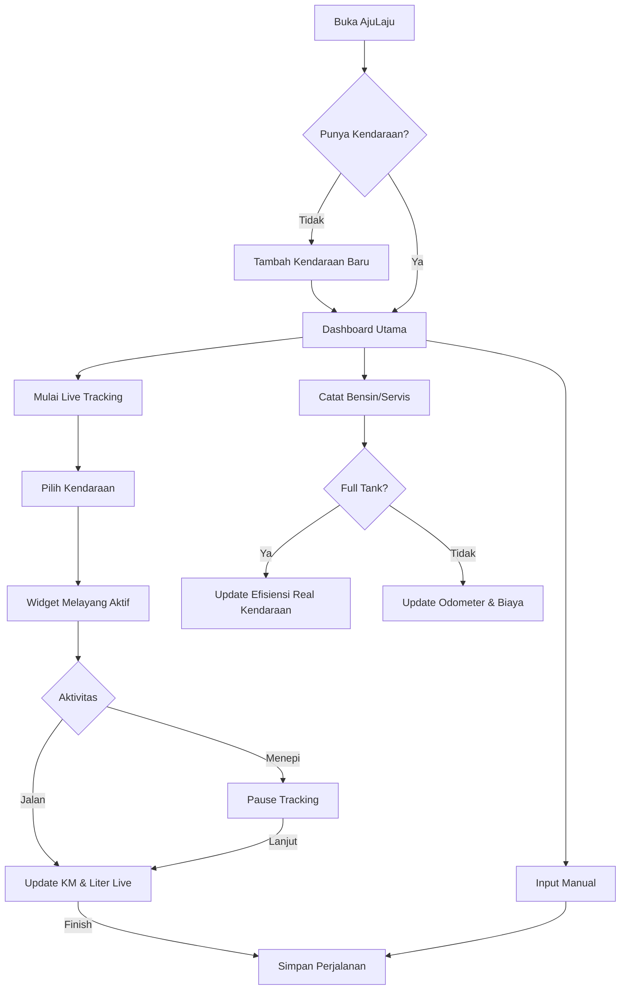

# 🚀 AjuLaju
**Asisten Pintar Pelacak Kendaraan & Efisiensi BBM**

AjuLaju adalah aplikasi Android modern yang dirancang untuk membantu pemilik kendaraan melacak perjalanan mereka secara presisi, mengelola biaya operasional, dan memantau efisiensi bahan bakar dengan logika yang cerdas dan realistis.

---

## 🌟 Fitur Unggulan

### 1. 🛸 Floating Tracking Widget
Rekam perjalanan Anda secara real-time dengan widget melayang yang tetap muncul di atas aplikasi lain (seperti Google Maps).
*   **Compact Design**: Hanya menampilkan informasi penting agar tidak mengganggu layar.
*   **Live Info**: Pantau kecepatan (km/h), jarak (km), dan estimasi liter BBM yang terpakai secara langsung.
*   **Pause/Resume**: Fleksibilitas untuk berhenti sejenak saat menepi tanpa merusak data statistik.

### 2. 🧠 Logika BBM Non-Linier (Smart Calculation)
Tidak seperti aplikasi pelacak biasa yang membagi rata bensin berdasarkan jarak, AjuLaju menghitung beban mesin berdasarkan kecepatan:
*   **Kondisi Macet (< 5 km/jam)**: Memberikan bobot **2.0x** lebih boros (idling/stop-and-go).
*   **Kondisi Lancar (40-80 km/jam)**: Menghitung dengan efisiensi optimal.
*   **Kecepatan Tinggi (> 80 km/jam)**: Menyesuaikan hambatan angin.

### 3. ⛽ Sistem Full-to-Full Otomatis
Hitung efisiensi nyata kendaraan Anda tanpa perlu alat tambahan. Cukup centang opsi "Full Tank" saat mengisi bensin, dan sistem akan mengalkulasi angka km/L asli kendaraan Anda.

---

## 🗺️ Alur Aplikasi (App Flow)



---

## 🛠️ Tech Stack
*   **Language**: Kotlin
*   **Database**: Room Persistence (SQLite)
*   **Background Task**: Android Foreground Services
*   **Location**: Google Play Services Location (FusedLocationProvider)
*   **Maps**: Osmdroid (OpenStreetMap)
*   **UI Components**: Material Design 3 (M3)
*   **Charts**: MPAndroidChart

---

## 📸 Tampilan Visual

### Dashboard
Area atas menampilkan total statistik dalam kartu premium, diikuti dengan tombol aksi cepat untuk Bensin dan Servis, serta daftar riwayat di bagian bawah.

### Konsep Widget Melayang
```text
+-----------------------+
| 📍 1.25 km         [^] | <--- Baris 1: Ringkasan
+-----------------------+
|  45 km/h  |  0.12 L   | <--- Baris 2: Detail Live
+-----------------------+
| [ Pause ] | [ Finish ]| <--- Baris 3: Kontrol
+-----------------------+
```

---

## 🚀 Cara Instalasi
1. Clone repository ini.
2. Buka di Android Studio (Koala atau versi terbaru).
3. Lakukan **Gradle Sync**.
4. Run pada Emulator atau HP Android (Min SDK 24).
5. Berikan izin **Lokasi** dan **Display Over Other Apps** untuk fitur tracking.

---

Developed with ❤️ for better driving experience.
